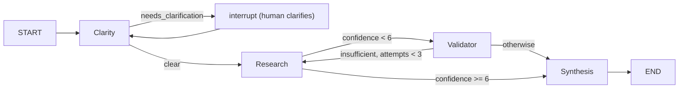
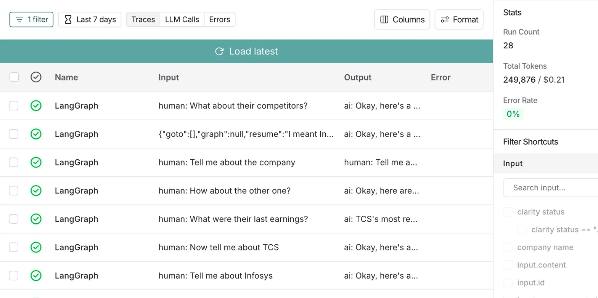
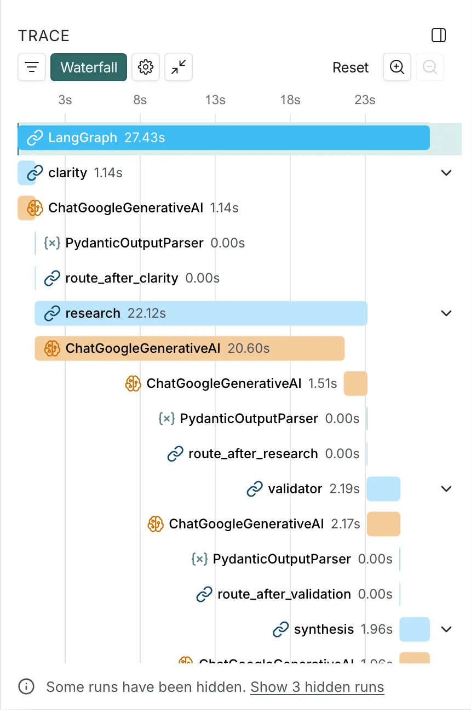

# Research Assistant — LangGraph Multi-Agent System

A multi-agent research assistant built with LangGraph. Four specialized agents handle company research: they decide when the query is clear enough to run, when to ask for clarification, and when to re-run research or hand off to synthesis. It supports multi-turn conversations, asks for clarification when the request is vague, and uses Gemini with live Google Search grounding — no mock data.

## Architecture



| Agent | What it does | Model |
|-------|----------------|-------|
| Clarity | Decides if the query is clear or needs clarification; extracts company name; uses conversation history and `last_discussed_company` for pronoun resolution | gemini-2.0-flash |
| Research | Runs live Google Search grounding, returns findings; a separate confidence model scores 0–10 | gemini-2.5-flash (search), gemini-2.0-flash (confidence) |
| Validator | Judges research sufficient/insufficient; critique and suggestions; increments research attempts | gemini-2.0-flash |
| Synthesis | Turns research + history into a single user-facing answer | gemini-2.0-flash |

## Project Structure

```
agents/       — Clarity, Research, Validator, Synthesis (class-based, lazy model init)
graph/        — State (GraphState), routing (conditional edges), builder (StateGraph + interrupt)
utils/        — Prompt templates used by all agents
tests/        — Unit tests (routing, clarity, research, validator, synthesis) and integration/multi-turn tests
config.py     — Loads .env and exposes get_gemini_api_key()
demo.py       — Runs example scenarios against the live graph
run_test.py   — Runs pytest with -x on tests/
```

## Setup

```bash
python -m venv .venv
source .venv/bin/activate   # or .venv\Scripts\activate on Windows
pip install -r requirements.txt
```

Put your Gemini API key in a `.env` file in the project root:

```
GEMINI_API_KEY=your_key_here
```

## Running Tests

- **Unit tests (no API key):** Routing, clarity, research, validator, and synthesis tests use mocks and do not call Gemini. Run: `pytest tests/ -k "test_route or test_clear or test_vague or test_research or test_validator or test_synthesis"`
- **Full suite (needs GEMINI_API_KEY):** Integration and multi-turn tests invoke the real graph and Gemini. Run: `python run_test.py` (or `pytest tests/`).

## Running the Demo

```bash
python demo.py
```

Runs three scenarios: clear query with follow-up, vague query triggering the interrupt flow, and company switching.

## Example Conversations

These are from actual test runs against the live Gemini API.

### Multi-turn with pronoun resolution

```
Turn 1 → "Tell me about Infosys"
  visited_nodes : [clarity, research, synthesis]
  clarity_status : clear
  company_name   : Infosys
  confidence     : 9.0
  response       : Infosys is a global leader in next-generation digital services
                   and consulting. Revenue for Q3 FY2025 was ₹41,764 crore...

Turn 2 → "Now tell me about TCS"
  visited_nodes : [clarity, research, synthesis]
  clarity_status : clear
  company_name   : TCS
  confidence     : 9.0
  response       : TCS is an IT services, consulting, and business solutions
                   organization. Q3 FY2025 revenue was ₹63,973 crore...

Turn 3 → "What were their last earnings?"
  visited_nodes : [clarity, research, synthesis]
  clarity_status : clear
  company_name   : TCS (resolved via last_discussed_company — no interrupt)
  response       : TCS's most recent quarterly results showed revenue of
                   ₹63,973 crore for Q3 FY2025, a 5.6% YoY increase...

Turn 4 → "How about the other one?"
  visited_nodes : [clarity, research, synthesis]
  clarity_status : clear
  company_name   : Infosys (resolved from conversation history)
  response       : Infosys reported Q3 FY2025 revenue of ₹41,764 crore...
```

### Vague query triggering human-in-the-loop

```
Turn 1 → "Tell me about the company"
  visited_nodes : [clarity]
  clarity_status : needs_clarification
  interrupt      : "Which company are you asking about?"

Turn 2 → User clarifies: "I meant Infosys"
  visited_nodes : [clarity_interrupt, clarity, research, synthesis]
  clarity_status : clear
  company_name   : Infosys
  confidence     : 9.0
  response       : Infosys is a global leader in next-generation digital
                   services and consulting...

Turn 3 → "What about their competitors?"
  visited_nodes : [clarity, research, synthesis]
  clarity_status : clear
  company_name   : Infosys (resolved via last_discussed_company — no interrupt)
  response       : Key competitors to Infosys in the IT services space include
                   TCS, Wipro, HCLTech, and Tech Mahindra...
```

Run `python demo.py` to see these live.

## Design Decisions

**Live search instead of mock data.** The assignment could have been satisfied with fake search results. I used Gemini's Google Search grounding so the system returns real, up-to-date company information. Failures (e.g. empty or unexpected responses) are surfaced as errors, not hidden behind fallbacks.

**Separate confidence model.** Research and "how confident are you?" are done by different calls. The same model call that did the research tends to overstate its own confidence; a second model call only assesses quality, which keeps the 0–10 score more honest and improves routing. I could have used another LLM entirely but didn't in the interests of time.

**Interrupt sends you back through Clarity.** After the user answers a clarification question, the graph uses `Command(goto="clarity")` instead of jumping straight to Research. Clarity re-runs with the new message and full history, so the same routing and company-extraction logic applies and state stays consistent.

**`last_discussed_company` in state.** Follow-ups like "What about their CEO?" or "Compare them to the other one" need a way to resolve "their" and "the other one." The research agent sets `last_discussed_company`; Clarity gets it in the system prompt so it can resolve pronouns and generic references without guessing.

**Prompts in `utils/prompts.py`.** All agent prompts live in one module. That makes them easy to edit, version, and reuse without digging through agent code.

## Observability

The system supports LangSmith tracing via environment variables — zero code changes. Every node, routing decision, and LLM call is automatically traced. Set `LANGCHAIN_TRACING_V2=true`, `LANGCHAIN_API_KEY`, and `LANGCHAIN_PROJECT` in your `.env` and all runs show up in the LangSmith dashboard.





## Assumptions

- Queries are company-focused; the system is not built for general Q&A.
- Model choice: gemini-2.5-flash for research (with search), gemini-2.0-flash for Clarity, Validator, Synthesis, and the research confidence assessor.
- Confidence threshold for "good enough to synthesize" is 6.0 (from the assignment).
- Research is retried at most 3 times per turn when the validator says insufficient.
- `.env` is in the project root and is loaded via `python-dotenv`; `config.py` does not read the file directly.

## Beyond Expected Deliverable

1. Live Google Search grounding instead of mock data
2. Unit tests that run without an API key (mocked agents)
3. Structured Pydantic output for clarity, confidence, and validation
4. Two-phase confidence: research model + separate confidence assessor
5. Prompt templates in `utils/prompts.py`
6. Class-based agents with lazy model initialization
7. Interrupt re-routes through Clarity after clarification (not straight to Research)
8. `last_discussed_company` in state for pronoun and reference resolution
9. LangSmith tracing via environment variables